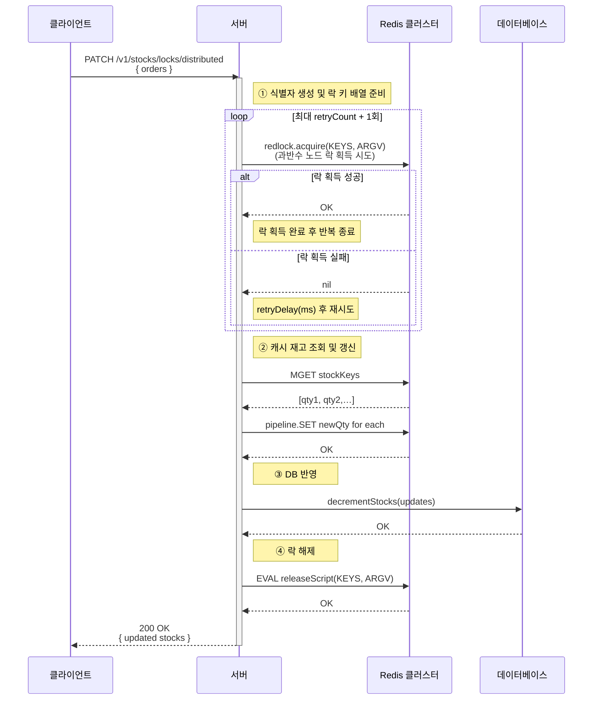
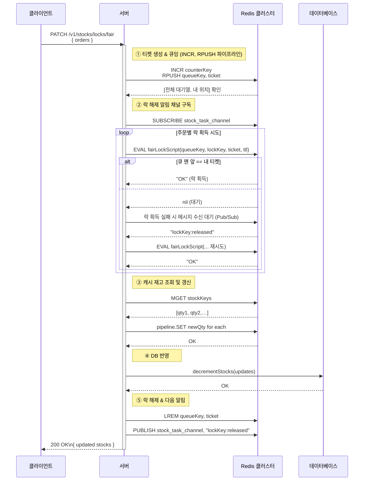

## 프로젝트 개요

이 프로젝트는 멀티 프로세스/서버가 공유 자원에대 대한 상호 배제를 보장하기 위해 사용하는 락을 구현한 프로젝트로 다음과 같은 두 가지 시나리오에 따른 두 가지 락 방식을 구현합니다.

프로젝트의 주요 목적은 Redlock 라이브러리에서 제공하는 분산락을 통한 공유 자원 상호 배제, Redis 큐 자료구조, LuaScript, Pub/Sub 메시징을 활용한 공유 자원 접근 순차 보장을 통해 동시성 문제를 처리함으로 락에 대한 이해도를 높이는 것입니다.

사용 기술

- Typescript, Nest.js, ElastiCache, Mysql, Client VPN

## 아키텍처

  

## 시퀀스 다이어그램

### 분산락

### 공정락

## JMeter 테스트

1. 상품 A,B,C에 각각 90개의 재고와 100명의 사용자를 준비한 뒤, 모든 사용자가 동시에 상품 구매를 시도합니다.
2. 결과로 90명의 사용자가 각각 1개씩 상품을 성공적으로 구매하고, 락을 획득하지 못한 임의의 사용자 10명은 구매에 실패해야 합니다.

### 분산락

  

테스트 결과 Sample#91 이후의 사용자들은 의도한 대로 상품을 구매하지 못했음을 확인할 수 있었습니다.

요청을 보낸 시간 순으로 정렬해보면,

  

응답 완료 순서가 불규칙함을 알 수 있습니다. 또한, 요청 시작 시간이 빠른 사용자도 락을 획득하지 못해 구매에 실패했는데, 이는 Redlock이 경쟁을 통해 임의로 락을 할당하기 때문입니다.

### 공정락

  

마찬가지로 Sample#91 이후의 사용자는 상품을 구매하지 못했음을 확인할 수 있습니다.

요청을 보낸 시간 순으로 정렬해보면,

  

요청 시작 시간이 빠른 순서대로 처리된 것을 확인할 수 있습니다. 즉, 구매에 실패한 10명의 사용자는 단순히 요청 타이밍이 늦었기 때문입니다.

단, 공정락으로 처리한 100명의 사용자는 약 17초가 소요된 반면, 분산락은 약 4초 만에 완료되어 공정성과 처리 속도 사이에 분명한 트레이드오프가 존재함을 알 수 있었습니다.

## 결론

각 락 방식의 장·단점을 고려하여, 필요에 따라 다음과 같이 선택하는 것이 합리적입니다.

- 재고 차감·단순 트랜잭션 등 공정성보다 처리 속도가 우선인 경우 → 분산락
  
- 플래시 세일·한정 수량 이벤트 등 요청 순서가 중요한 경우 → 공정락

## 개발 이슈 사항

